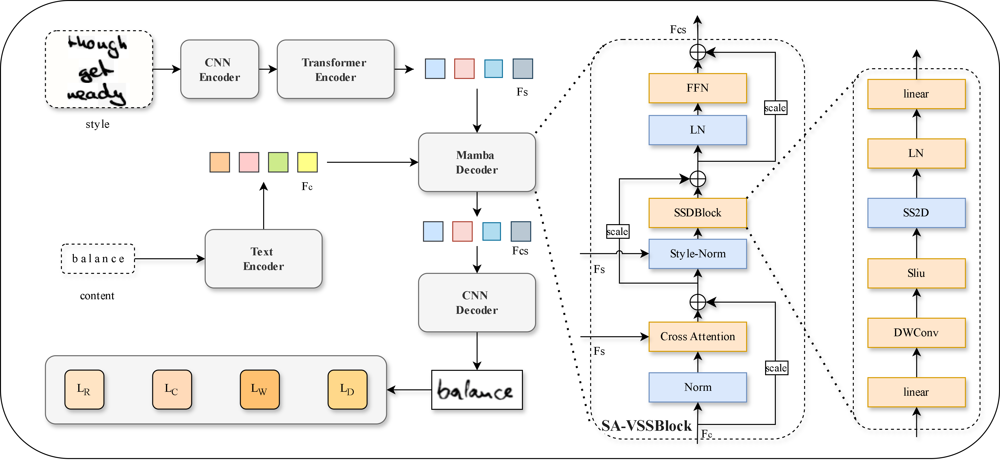

# SA-VSSM

**SA-VSSM: Style-Adaptive Visual State Space Model for Handwritten Text Generation**

This repository provides the official PyTorch implementation of:

> **"SA-VSSM: Style-Adaptive Visual State Space Model for Handwritten Text Generation"**

SA-VSSM introduces a continuous sequence modeling framework for handwritten text generation, decoupling style control into texture and dynamic flow through a novel Dual-Stream Style Injection mechanism.


*Overview of the SA-VSSM architecture.*

## Key Ideas

- **SSM-based Generative Decoder**: Uses Mamba as the core decoder to natively model continuous, fluid stroke trajectories.
- **Dual-Stream Style Injection**:
  - *Cross-Attention* — explicit texture fusion (ink color, stroke width).
  - *Style-Norm* — implicit state conditioning via adaptive normalization to steer stroke dynamics.
- **Lightweight & Efficient**: 28.81M parameters, 211.27 GFLOPs.

## Quick Start

### Installation

```bash
# 1. Create environment (Python 3.9+)
conda create --name savssm python=3.9
conda activate savssm

# 2. Install PyTorch (adjust CUDA version as needed)
conda install pytorch==2.1.0 torchvision==0.16.0 torchaudio==2.1.0 pytorch-cuda=11.8 -c pytorch -c nvidia

# 3. Install dependencies
pip install -r requirements.txt

# 4. Install Mamba modules
pip install causal-conv1d>=1.1.0
pip install mamba-ssm

# 5. Download pretrained checkpoints and dataset files
# From [Google Drive](https://drive.google.com/drive/folders/13rJhjl7VsyiXlPTBvnp1EKkKEhckLalr)
# Place files into the `files/` directory.
```

### Training

```bash
python train.py \
    --dataset IAM \
    --data_path ./files/iam_dataset.pkl \
    --checkpoints_dir ./checkpoints \
    --batch_size 32 \
    --wandb
```

### Inference

```bash
# Batch generation (for FID evaluation)
python generate_fakes.py --checkpoint saved_models/IAM-339-15-E3D3-LR5e-05-bs8-debug --testepoch 8000

# Single text generation with custom style images
python generate_fakes_single.py --checkpoint saved_models/IAM-339-15-E3D3-LR5e-05-bs8-debug --testepoch 8000
```

## Project Structure

```
SA-VSSM-main/
├── models/
│   ├── model.py          # Main model (Generator + Discriminators)
│   ├── vmamba.py         # VSSBlock, SS2D, Style-Norm
│   ├── transformer.py    # Transformer encoder/decoder
│   ├── OCR_network.py    # CRNN-based OCR
│   └── ...
├── data/
│   └── dataset.py        # Dataset classes
├── util/
│   └── util.py          # Loss functions, utilities
├── train.py             # Training entry point
├── generate_fakes.py    # Batch image generation
├── generate_fakes_single.py  # Single-sample generation
└── config.py            # Configuration
```

## Acknowledgements

This project builds on ideas from [HWT](https://github.com/ankanbhunia/Handwriting-Transformers) and [VATr](https://github.com/aimagelab/VATr).
